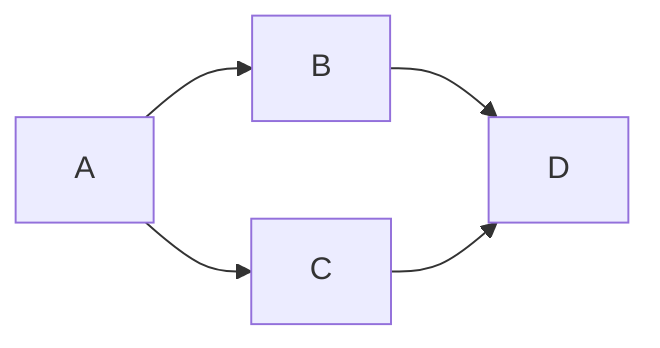
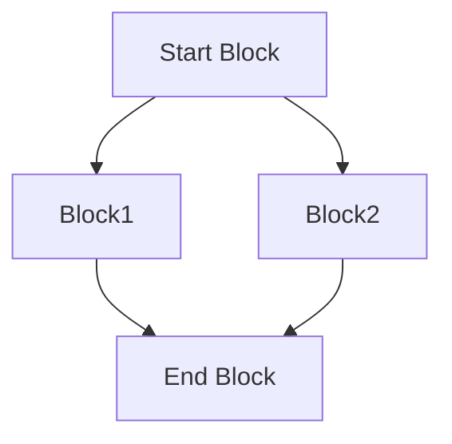
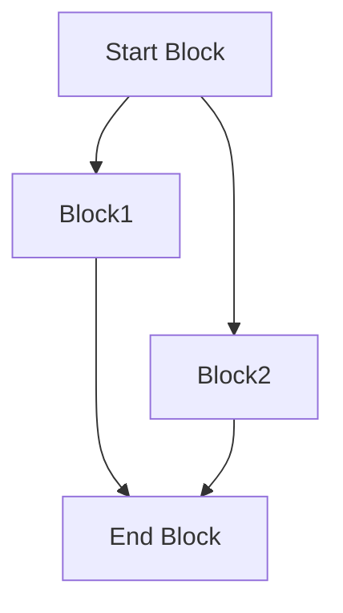
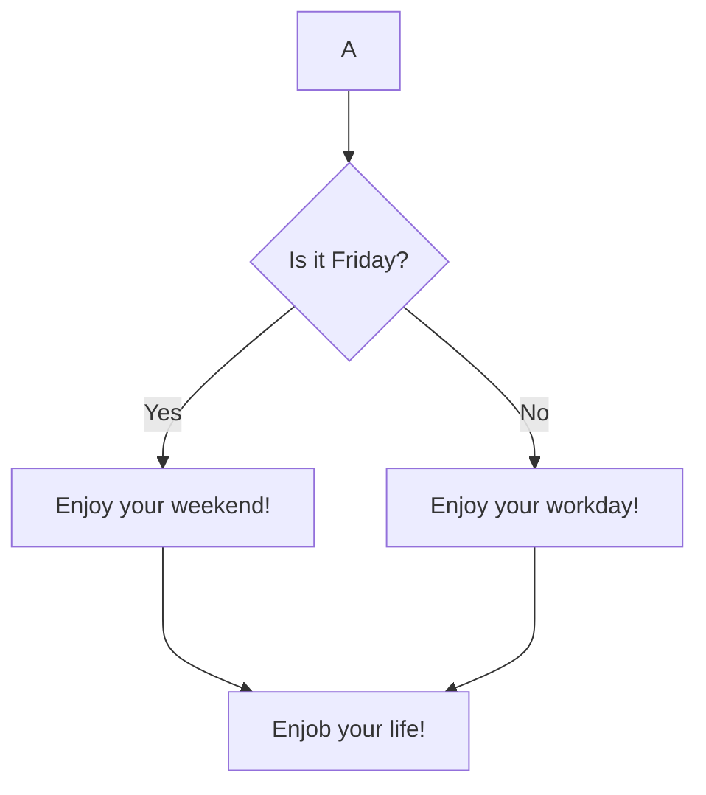
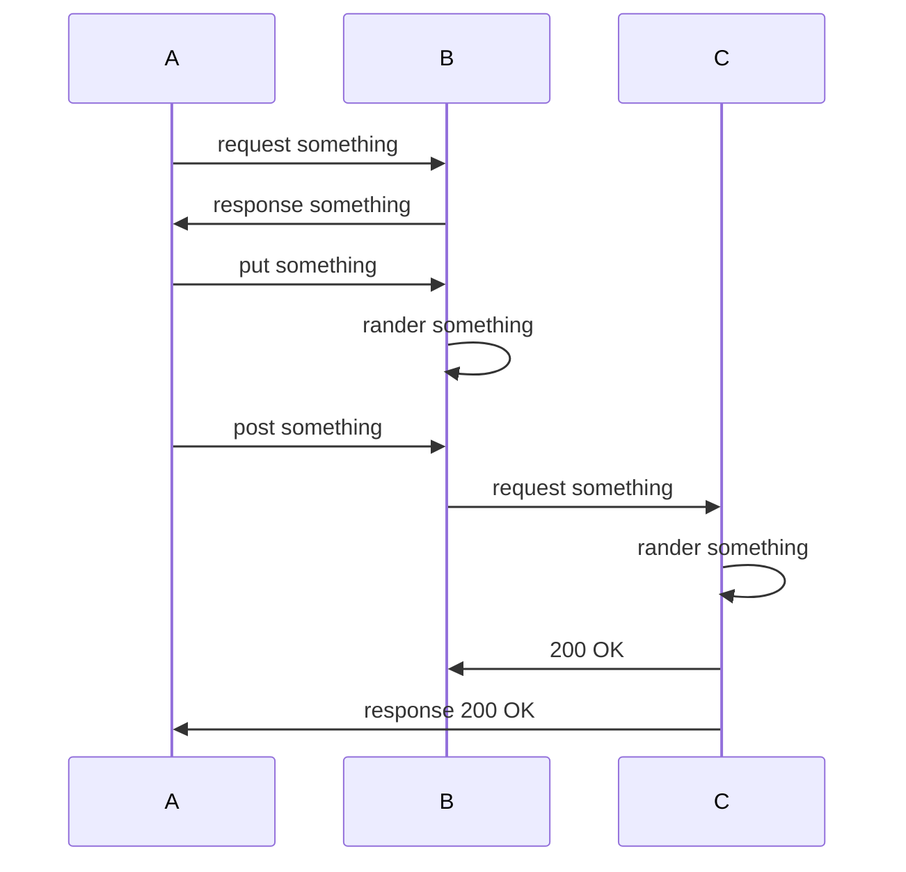

# diagrams-markdown-mermaid

Include diagrams in your Markdown files with Mermaid

### IDE Support

Jetbrains IDEA enable Markdown mermaid extension:  

```Prefences > Languages & Frameworks > Markdown > Markdown extensions > Mermaid``` 

Visual Studio Code install Markdown mermaid support plugin:  
[VS Code Mermaid Support Plugin](https://marketplace.visualstudio.com/items?itemName=bierner.markdown-mermaid)

## Flowchart

### Example 1: Get Started Top-Down Diagram


`flowchart TD` means `flowchart top-down`.

### Example 2: Get Started Left-Right diagram



`flowchart LR` means `flowchart left-right`.

### Example 3: Block Name



The diagram `default` direction is `Top-Down`.

### Example 4: Line Length



The line length of three-dash `---` is longer than the two-dash `--` one. And the least number of 
the dash must be 2.

### Example 5: Conditional Branch



The conditional block is marked as `Block_Label{}`.

## Sequence Diagram

### Example 6: Get Started


- The `participant Label` represents a participant component of the sequence diagram.
- A line between participants follows the rule: `Label ->> Label: Comment above line`

## Reference Links

- https://github.blog/2022-02-14-include-diagrams-markdown-files-mermaid/
- https://docs.github.com/en/get-started/writing-on-github/working-with-advanced-formatting/creating-diagrams